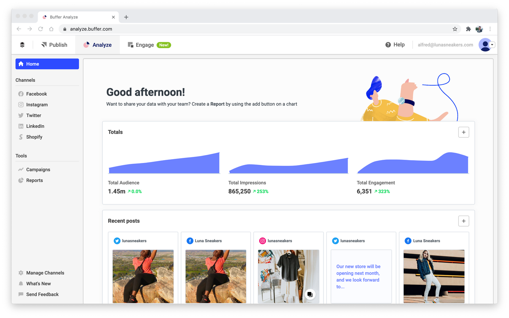

## 🚀 Abel Gideon | Developer Portfolio

Welcome to my developer portfolio — a showcase of my passion, skills, and projects!

This portfolio was built during my first hackathon with Power Learn Project (PLP) and reflects my journey as a Software Developer.
All the lines of code were written purely in vannila HTML and CSS.

## 🧑‍💻 About Me

I'm Abel Gideon, a self-driven software developer with 2+ years of experience in both frontend and backend development.  
My core mission? Build clean, responsive, and impactful digital experiences that solve real-world problems.

- 🔭 I'm currently mastering full-stack development
- 🌱 Passionate about creating solutions, not just code
- 🌍 Based in Abuja, Nigeria
- 🎓 BSc in Computer Science
- 💬 Ask me about JavaScript, React, Node.js, or how I survive debugging marathons


## 🛠️ Tech Stack

🚧 Front-End
- HTML5 | CSS3 | JavaScript | TypeScript | React.js

🔧 Back-End
- Node.js | MySQL | Python (Basic)

🗃️ Others
- Git & GitHub  
- Responsive Design  
- Formspree Integration  
- Basic SEO structure

---

## 📂 Projects
You will find some of my recent projects such as:

🌟 1. Budibase
> A low-code internal tools platform featuring quick deployment, intuitive interfaces, and powerful data management.

📦 2. BaseCamp
> A real-time project management app that helps teams track, collaborate, and organize seamlessly.

📊 3. Analiza
> A sleek data analytics dashboard that provides key insights using powerful data visualizations.


👉 More Projects? Check my [GitHub Repositories »](https://github.com/valour11?tab=repositories)

---

## 🌐 Hosted Live Demo

> ✅ Visit the live portfolio: [https://gideon-abel-portfolio.vercel.app/](https://gideon-abel-portfolio.vercel.app/)  


## 🖼️ Preview

Here’s a sneak peek at what the portfolio looks like:

  


## 📬 Contact Me

Have a question, collaboration idea, or just want to say hello?

- ✉️ Email: [gideonabel87@gmail.com](mailto:gideonabel87@gmail.com)  
- 📞 Phone: [+234 704 345 6740](tel:+2347043456740)  
- 💼 LinkedIn: [Gideon Abel](https://www.linkedin.com/in/gideon-abel-629961215)  
- 💻 GitHub: [valour11](https://github.com/valour11)  
- 📱 WhatsApp: [Click to Chat](https://wa.me/2347043456740?text=Hello%20I%20checked%20your%20portfolio%20and%20I’d%20like%20to%20connect)


## 📁 Folder Structure

```
├── index.html
├── style.css
├── /scr
│   └── /images
│       └── (all icons, project screenshots, and profile images)
```


## 🛠️ Features

- Fully responsive across all screen sizes ✅  
- Smooth navigation with internal linking ✅  
- Clean, minimalist design ✅  
- Integrated contact form via Formspree ✅  
- Linked social handles (LinkedIn, GitHub, WhatsApp, etc.) ✅


## 🙌 Acknowledgements

- Built during my **first hackathon** with Power Learn Project (PLP) (https://powerlearnproject.org)  
- Icons from [Icons8](https://icons8.com)  
- Images and assets created by me or from open sources


## 🧠 Fun Fact

> I’m the type of developer who will solve a bug and then stare at the screen for five minutes just to admire the magic.


## 📄 License

This portfolio is open for learning and inspiration. Feel free to use ideas or structure, but give credit where due ✌️


> _Crafted with 💙 by Abel Gideon_
